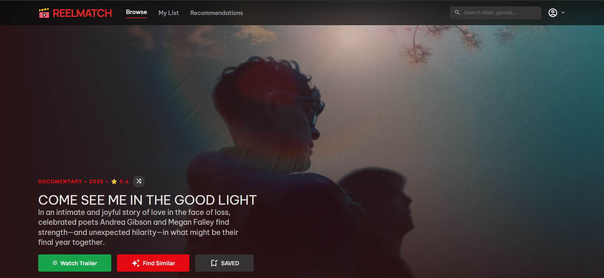
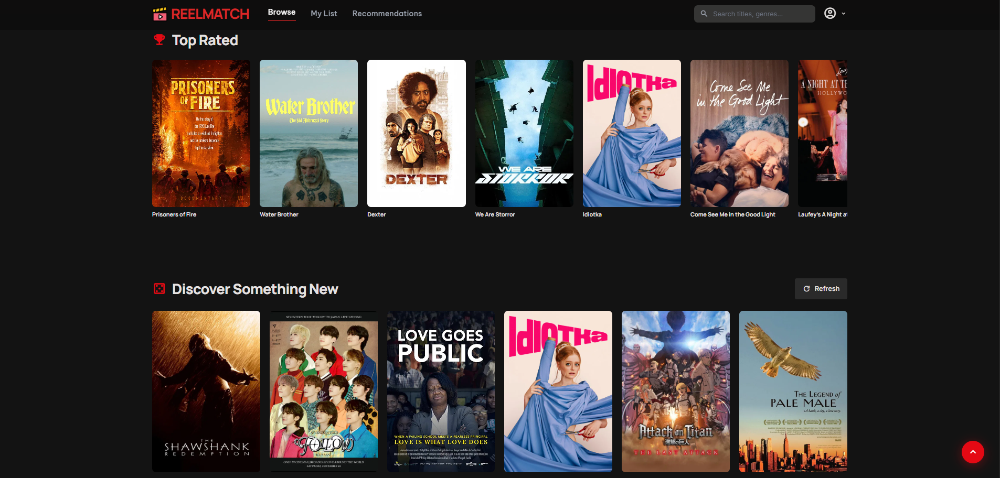
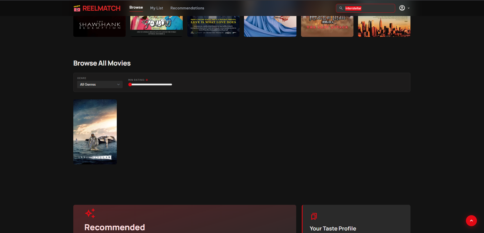
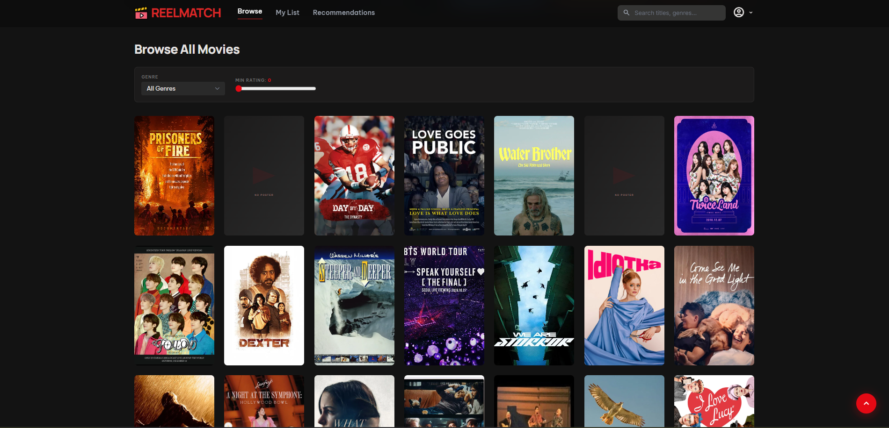
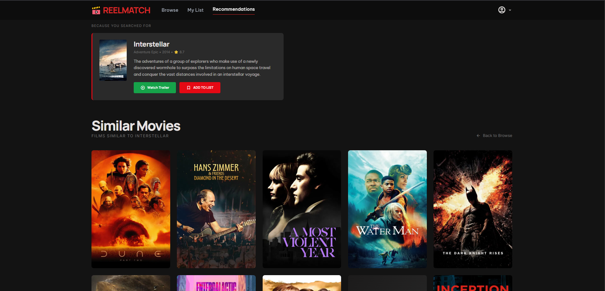
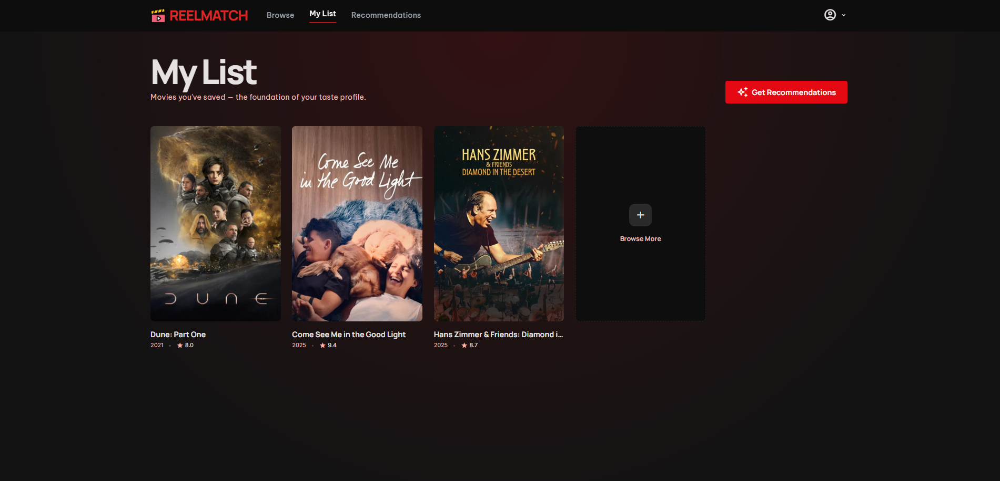
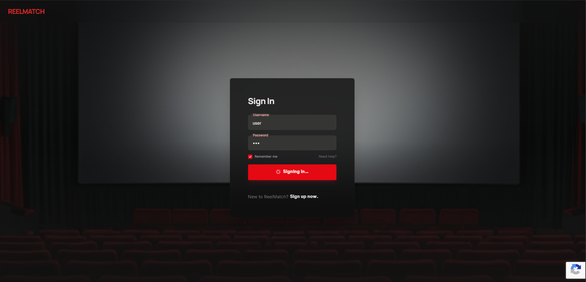
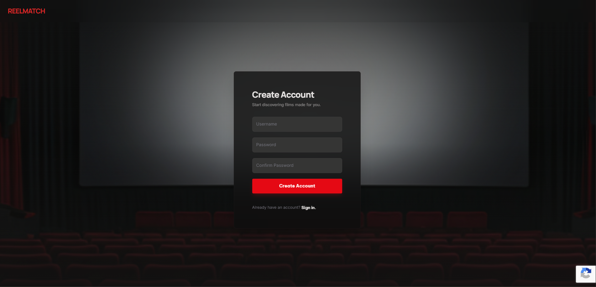

# ReelMatch 🎬

**ReelMatch** is an AI-powered movie recommendation web application built with Django and Django REST Framework. It uses a content-based filtering model trained on movie metadata (genres, directors, cast) to generate personalized movie recommendations.

---

## Table of Contents

* Features
* Tech Stack
* Pages & UI
* Project Structure
* Getting Started
* Environment Variables
* Database & Data Import
* ML Recommendation Engine
* API Reference
* Roadmap
* License

---

## Features

* Secure authentication with reCAPTCHA v3
* Movie discovery with search, filters, and pagination
* Content-based recommendation engine using TF-IDF + cosine similarity
* TMDB integration for posters, backdrops, and metadata
* YouTube trailer playback
* Responsive UI using Tailwind CSS

---

## Tech Stack

| Layer    | Technology                      |
| -------- | ------------------------------- |
| Backend  | Django 6, Django REST Framework |
| Auth     | Token Auth, reCAPTCHA v3        |
| Database | SQLite (dev)                    |
| ML       | pandas, scikit-learn, joblib    |
| Frontend | Vanilla JS, Tailwind CSS (CDN)  |
| APIs     | TMDB API, YouTube Data API v3   |

---

## Pages & UI

### 🎬 Browse Page

| Hero Section                                                                           | Top Rated Carousel                                                                     |
| -------------------------------------------------------------------------------------- | -------------------------------------------------------------------------------------- |
| <a href="docs/images/browse1.png"></a> | <a href="docs/images/browse2.png"></a> |

| Search / Filter                                                                        | Movie Grid                                                                             |
| -------------------------------------------------------------------------------------- | -------------------------------------------------------------------------------------- |
| <a href="docs/images/browse3.png"></a> | <a href="docs/images/browse4.png"></a> |

---

### 📄 Other Pages

| Recommendations                                                                                        | My List                                                                              |
| ------------------------------------------------------------------------------------------------------ | ------------------------------------------------------------------------------------ |
| <a href="docs/images/recommendations.png"></a> | <a href="docs/images/mylist.png"></a> |

| Sign In                                                                              | Sign Up                                                                              |
| ------------------------------------------------------------------------------------ | ------------------------------------------------------------------------------------ |
| <a href="docs/images/signin.png"></a> | <a href="docs/images/signup.png"></a> |

---

| Page            | URL                 | Description                    |
| --------------- | ------------------- | ------------------------------ |
| Landing         | `/`                 | Marketing page with CTA        |
| Sign In         | `/signin/`          | Login with reCAPTCHA           |
| Sign Up         | `/signup/`          | User registration              |
| Browse          | `/homeFeed/`        | Hero, carousel, and movie grid |
| My List         | `/myList/`          | User watchlist                 |
| Recommendations | `/recommendations/` | AI-based results               |

### Key UI Features

* Shared Movie Modal (details, watchlist toggle, trailer)
* Toast notifications for actions
* Hero shuffle for featured movies
* YouTube trailer overlay player

## Project Structure

```
MMS/
├── settings.py
├── urls.py

accounts/
├── models.py
├── views.py
├── urls.py
├── templates/accounts/
├── static/accounts/js/
├── management/commands/import_movies.py

api/
├── views.py
├── serializers.py
├── urls.py
├── apps.py
├── watch/

ml_models/
├── movie_similarity.joblib
├── movie_vectorizer.joblib
├── movie_metadata.csv
```

---

## Getting Started

### Install

```bash
python -m venv .venv
.venv\Scripts\activate  # Windows
pip install -r requirements.txt
```

### Environment

```env
TMDB_API_KEY=your_key
RECAPTCHA_SITE_KEY=your_key
RECAPTCHA_SECRET_KEY=your_key
YOUTUBE_API_KEY=your_key
```

### Migrate & Seed

```bash
python manage.py migrate
python manage.py import_movies
```

### Run

```bash
python manage.py runserver
```

---

## Database & Data Import

* `import_movies.py` → seeds dataset
* `discover_movies.py` → fetches new TMDB movies
* `enrich_movies.py` → fills missing metadata

---

## ML Recommendation Engine

### Pipeline

1. Combine metadata (genres, cast, director)
2. Apply TF-IDF vectorization
3. Compute cosine similarity matrix
4. Store artifacts using joblib
5. Load at Django startup

### Recommendation Flow

* Input movie title
* Retrieve index
* Fetch similarity scores
* Return top 10 most similar movies

---

## API Reference

| Endpoint          | Method          | Auth   | Description         |
| ----------------- | --------------- | ------ | ------------------- |
| `/api/signup/`    | POST            | Public | Register user       |
| `/api/login/`     | POST            | Public | Login               |
| `/api/logout/`    | POST            | Token  | Logout              |
| `/api/movies/`    | GET             | Public | Movie list          |
| `/api/watchlist/` | GET/POST/DELETE | Token  | Manage watchlist    |
| `/api/recommend/` | GET             | Public | Get recommendations |
| `/api/watch/`     | GET             | Public | Fetch trailer       |

## License

MIT © 2026 ReelMatch